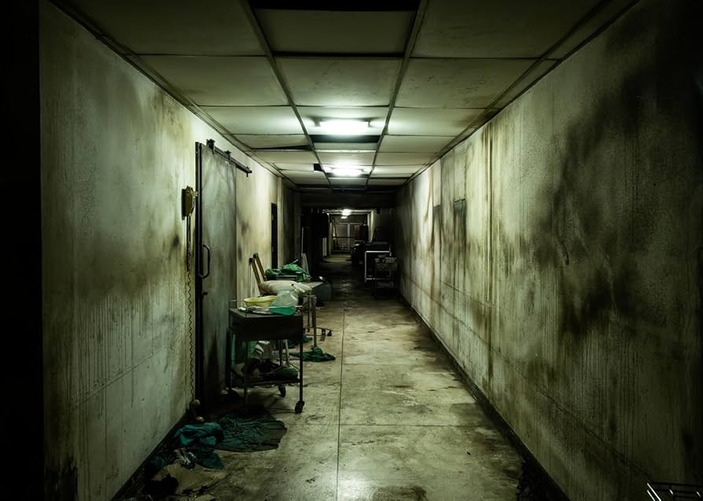

Diseno de escenarios y niveles

Escenarios

🏥 Hospital

Un entorno clínico donde se percibe el olor a desinfectante. Las luces son frías y blancas, y se oyen los pitidos constantes de monitores cardíacos. Hay salas de espera silenciosas y pasillos largos con puertas metálicas. El ambiente tiene cierto grado de hostilidad.

**Elementos comunes:**
- Camillas oxidadas o limpias
- Equipos médicos (respiradores, monitores, sillas de ruedas)
- Habitaciones con cortinas blancas
- Archivos médicos tirados
- Restos de medicamentos o jeringas

Niveles