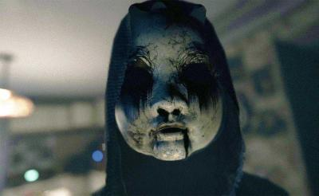

<h1>The Team</h1>

Un grupo dispar unido por la desesperación, cada miembro arrastra su propio pasado oscuro y habilidades únicas para enfrentar las entidades sobrenaturales que los persiguen. No son superhéroes, sino personas rotas que luchan por mantenerse con vida un día más.

<h1>Personajes</h1>

<h1>Heroes</h1>

Elena Vance - La Cazadora de Sombras:

Apariencia: 30-35 años, vestimenta práctica de cuero desgastado sobre ropa térmica. Cara marcada por una cicatriz tenue en la mejilla. Ojos grises y vigilantes. Lleva un arco compuesto futurista y una aljaba con flechas de diversos materiales (plata, ébano, cristal).

Personalidad: Seria, estoica y pragmática. Habla poco, pero sus acciones son precisas. Tiene un profundo desprecio por lo sobrenatural que mató a su familia. Es protectora con el grupo, especialmente con la adolescente.

Habilidad Única: "Ojo del Acechador" - Puede rastrear huellas de energía ectoplásmica invisible y ver puntos débiles en enemigos no corpóreos durante unos segundos.

Maya Chen - La Adolescente Sensible:

Apariencia: 16-17 años, ropa juvenil moderna pero ahora sucia y rasgada. Lleva una mochila con provisiones básicas y objetos personales (teléfono sin señal, libro favorito). Expresión entre asustada y determinada. Tiene un pequeño amuleto de ojo turco que le dio su abuela.

Personalidad: Asustadiza al principio, pero desarrolla una valentía sorprendente. Es empática y curiosa, a veces demasiado. Tiene pesadillas recurrentes que a veces contienen fragmentos de verdad. Su inocencia es un arma de doble filo contra ciertas entidades.

Habilidad Única: "Eco Emocional" - Puede sentir las emociones residuales fuertes en un lugar (miedo, dolor, ira) y percibir la presencia cercana de entidades invisibles como un zumbido o frío intenso.

Silas Thorne - La Bruja de los Susurros:

Apariencia: 40-45 años, pelo largo y recogido con huesos pequeños. Ropas oscuras, holgadas y bordadas con runas desvaídas. Porta un grimorio antiguo atado con correas y un bastón de madera retorcida con un cristal ahumado en la punta. Sus ojos cambian de color sutilmente con su estado de ánimo.

Personalidad: Enigmática, sabia pero con un humor oscuro. Sabe más de lo que dice. Se comunica con espíritus menores (no siempre confiables). Siente una conexión/responsabilidad con el desequilibrio sobrenatural. Tiene un pasado del que no habla.

Habilidad Única: "Velum Laceratus" - Puede desgarrar temporalmente el "velo" entre dimensiones, atrapando o dañando a entidades fantasmales o creando brechas defensivas.

Bastion "Roca" Kruger - El Mercenario Marcado:

Apariencia: 38-40 años, físico imponente. Viste ropa táctica adaptada. Su rasgo definitorio: grandes placas de piel en brazos, cuello y parte de la cara están petrificadas, como piedra grisácea y agrietada (Síndrome de Petra). Ojos azules intensos que contrastan con su piel. Lleva una escopeta recortada y granadas de sal.

Personalidad: Brutalmente directo, leal a quien paga (inicialmente) y con un código de honor extraño. Su enfermedad lo aísla y duele. Ve lo sobrenatural como otro enemigo a eliminar. Desarrolla un vínculo protector con Silas, quien intenta aliviar su dolor.

Habilidad Única: "Piel de Piedra" - Las zonas petrificadas pueden absorber parcialmente ataques físicos e incluso espectrales brevemente, pero usar la habilidad avanza su enfermedad y causa dolor agudo.

Dorian Finch - El Detective Obsesivo:

Apariencia: 50-55 años, gabardina raída sobre un traje barato. Cara cansada, con ojeras profundas. Siempre fumando un cigarrillo electrónico (la única luz constante). Lleva una linterna potente y una vieja Smith & Wesson .38 con balas modificadas.

Personalidad: Cínico, sarcástico y atormentado por un caso sin resolver vinculado a lo sobrenatural. Tiene una memoria enciclopédica para detalles macabros. Desconfiado, pero su instinto policial es agudo. Se une al grupo buscando respuestas personales.

Habilidad Única: "Huellas del Crimen" - Puede reconstruir breves escenas de eventos traumáticos pasados en un lugar al concentrarse, revelando pistas o la naturaleza de una amenaza.

Agente Marcus Rook - El Especialista del FBI (Paranormal):

Apariencia: 40 años, aspecto pulcro pero ahora desaliñado. Traje resistente bajo un chaleco táctico con el logotipo de una unidad ficticia del FBI (ej: P.A.C.T. - Paranormal Assessment & Containment Team). Porta una pistola de pulsos "calibradora" y varios dispositivos de medición (EMF, termógrafo).

Personalidad: Escéptico por entrenamiento, pero los eventos lo han obligado a creer. Metódico, analítico y líder natural. Busca respuestas y pruebas, pero prioriza la supervivencia del grupo. Tiene un protocolo para todo.

Habilidad Única: "Escáner de Fase" - Dispara un pulso de energía que revela entidades incorpóreas brevemente, ralentiza a las manifestaciones fantasmales débiles y puede interactuar con objetos etéreos.

<h1>Villanos</h1>

El Anciano de Raíces (Depredador Principal)
Apariencia: Un humanoide de corteza negra y raíces retorcidas, con un "rostro" de hongos bioluminiscentes. De su boca brotan líquenes que se mueven como lenguas.

Origen: Espíritu del bosque que absorbió la agonía de los leñadores asesinados aquí.

Habilidades:

"Abrazo del Árbol": Raíces que inmovilizan y absorben salud lentamente.

Esporas de Pesadilla: Nube que causa alucinaciones de criaturas de madera atacando.

 El Doctor Quiroga (Depredador Principal)
Apariencia: Un hombre obeso con piel cosida como un muñeco de trapo, su cabeza es una máscara de vendas sangrantes con una sonrisa grabada a bisturí. Lleva un delantal lleno de bolsillos con "recuerdos" de pacientes.

Origen: Psiquiatra que realizaba lobotomías con herramientas caseras. Ahora "opera" almas para "curar su locura".

Habilidades:

"Sala de Cirugía": Atrapa jugadores en mesas quirúrgicas espectrales que infligen daño continuo.

Bisturí del Recuerdo: Roba habilidades temporales del jugador y las usa en su contra.

La Dama del Piano (Manipulador Espiritual)
Apariencia: Una mujer espectral en vestido de gala negro, con el rostro cubierto por un velo de telarañas. Sus manos, invisibles, tocan un piano fantasma que resuena en toda la mansión.

Origen: Una concertista que enloqueció al descubrir que su esposo (el Coleccionista) la asesinó para "conservar su música eternamente".

Habilidades:

"Melodía de Locura": Si los jugadores escuchan la canción completa, sufren alucinaciones de pianos que se cierran como trampas.

Notas de Angustia: Teclas espectrales que cortan como cuchillas al pisarlas.

La Madre de Luto (Depredador Principal)
Apariencia: Una figura femenina con un vestido empapado en agua cenagosa, cabello flotante como algas y ojos vacíos que vomitan líquido negro. Sus brazos se alargan como serpientes de fango.

Origen: Madre que ahogó a sus hijos y ahora arrastra a otros a su tumba-acuático para "reemplazarlos".

Habilidades:

"Abrazo Ahogado": Atrapa jugadores en charcos que se convierten en tumbas verticales.

Lágrimas Venenosas: Proyectiles de agua corrosiva que ciegan temporalmente.

La Niña de los Espejos (Manipulador Espiritual)
Apariencia: Una niña de 8 años con un vestido de hospital manchado, pero su reflejo muestra un rostro envejecido y dientes de sierra. Solo aparece en cristales rotos.

Origen: Paciente infantil sometida a terapias de luz que la fusionaron con su propio reflejo.

Habilidades:

"Juego de Reflejos": Intercambia lugares con el jugador si este mira un espejo.

Risas Fracturadas: Provoca mareo y desorientación auditiva.

El Sepulturero Cantor (Manipulador Espiritual)
Apariencia: Un hombre enjuto con piel de tierra agrietada, vestido con un overol podrido. Canta nanas desafinadas mientras arrastra una pala oxidada que deja huellas de gusanos.

Origen: Enterrador que vivió tanto que se convirtió en parte del cementerio. Cava fosas para "guardar secretos".

Habilidades:

"Canción de la Fosa": Atrae a jugadores hacia tumbas abiertas con un efecto hipnótico (deben taparse los oídos).

Gusanos de la Revelación: Si te tocan, muestran visiones de tu propia muerte.

La Tejedora de Huesos (Manipulador Espiritual)
Apariencia: Una anciana esquelética sentada en un telar hecho de tendones secos. Teje "destinos" con hilos de cabello humano. Sus dedos son agujas de hueso.

Origen: Bruja que hilaba ropa con restos de viajeros para atraer su suerte. El bosque la maldijo a tejer eternamente.

Habilidades:

"Hilo del Destino": Si lo tocas, te fuerza a caminar hacia ella como un títere.

Sudario de Penumbra: Crea réplicas ilusorias de los jugadores que los atacan.

El Coleccionista de Almas (Depredador Principal)
Apariencia: Un esqueleto alto vestido con un traje victoriano carcomido, su "cabeza" es un biombo giratorio de mariposas nocturnas disecadas cuyas alas susurran nombres de víctimas. Sus dedos son agujas de hueso que gotean cera derretida.

Origen: Antiguo aristócrata que embalsamaba vivos a sus invitados para preservar su belleza en cuadros vivientes. Ahora atrapa almas en mariposas de cristal.

Habilidades:

"Galería del Horror": Atrapa jugadores en cuadros espectrales que drenan salud (requieren romper el marco).

Enjambre de Memorias: Mariposas que distorsionan la visión y revelan miedos personales del jugador.

<h1>NPCs</h1>

La Dama de los Espejos (Casas Abandonadas):

Apariencia: Una anciana vestida con harapos de época, impecablemente limpios. Su rostro es una niebla cambiante que solo se refleja claramente en las superficies de los espejos, mostrando una joven triste o una anciana sonriente. Sus manos son huesudas y translúcidas.

Función: Aparece en reflejos para dar pistas crípticas, señalar peligros ocultos o mostrar eventos pasados. Es inofensiva físicamente, pero su presencia y mensajes pueden ser desorientadores o aterradores. Su verdad y motivación son un misterio.

El Prestamista de Susurros (Varios Puntos, da Avisos):

Apariencia: Un hombre de mediana edad con un traje de tres piezas impecable pero de un gris ceniza antinatural. Su voz es un susurro metálico que resuena directamente en la mente del jugador. No tiene sombra ni se refleja. Siempre aparece donde menos se le espera (callejones, pasillos vacíos).

Función: Ofrece información crucial sobre amenazas inminentes, debilidades de jefes o ubicaciones de objetos vitales. El precio es siempre alto: un recuerdo preciado (que el jugador "olvida" temporalmente, afectando habilidades/personalidad), una promesa futura, o realizar una tarea peligrosa y moralmente cuestionable.

El Guardián de Umbrales (Cementerio & Hospital Abandonado):

Apariencia: Un hombre alto y demacrado, vestido con un uniforme de guardia de cementerio antiguo y descolorido, o una bata de enfermero manchada (dependiendo de la ubicación). Su rostro está oculto bajo una sombra permanente, solo se ven sus ojos, tristes y cansados. Lleva una linterna de aceite que proyecta más sombras que luz.

Función: Conoce los caminos "seguros" y las rutas ocultas dentro de su territorio. Puede abrir puertas bloqueadas o selladas a cambio de objetos específicos y personales con carga emocional de los jugadores. Es neutral, pero incumplir acuerdos con él atrae desgracia.

